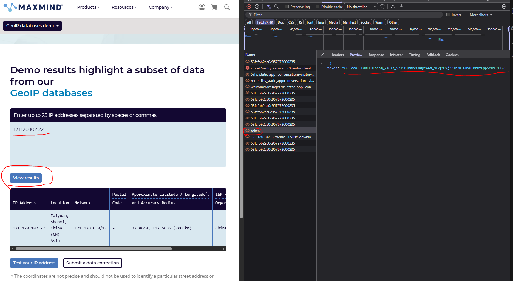
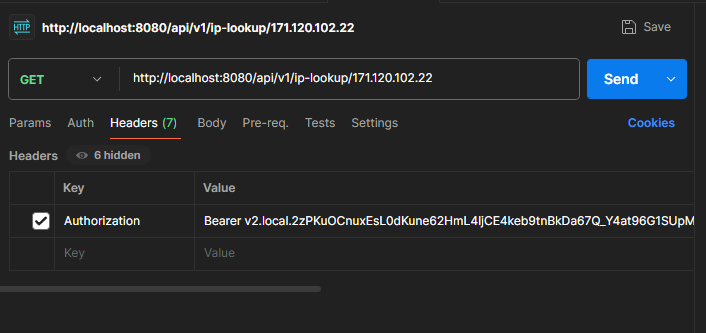
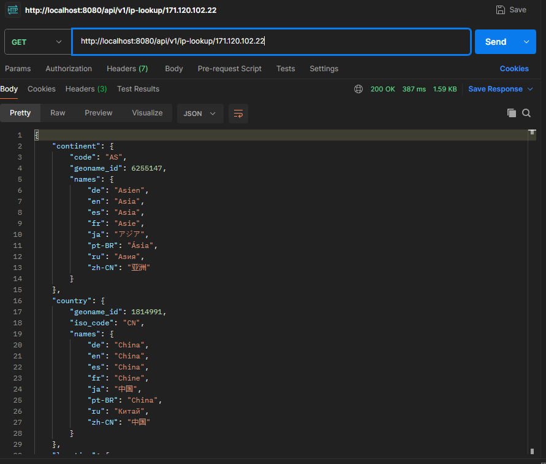

# Getting started

Install [Golang](https://go.dev/doc/install).  
Install [Postman](https://www.postman.com/downloads/).

To run the application. This will host an API endpoint on `localhost:8080`.
```cmd
go run cmd/api/main.go
```

In a browser, navigate to this URL to see the Swagger
```
http://localhost:8080/swagger/index.html
```

### Retrieve Authorization token

Go to https://www.maxmind.com/en/geoip-demo.  
Open the Network tab.  
Enter an IP in the tool, click "View results" to run the tool.  
Find the endpoint on the network tab called `token`.


### Call the endpoint:
```
GET
http://localhost:8000/api/v1/ip-lookup/{ip-address}
```

Use the retrieved token in a Postman request as the `Authorization` header, prefixed by `Bearer`.

For example:
```
Bearer v2.local.2zPKuOCnuxEsL0dKune62HmL4IjCE4keb9tnBkDa67Q_Y4at96G1SUpMPns36lo9wjM_fwN9ummFu22Ce5rJ-J0APdFdfD3WyygWKeSCLiIbGb65bSWZxVlsqmNiZBB5tfMLQadRnWeohWptQtlG-ya6B9FFz3p_qQkCvSnwc5m1FdIiQVcirFMnnBC-vX-fWklPkbpXIbNJxTgd
```


Click "Send"

